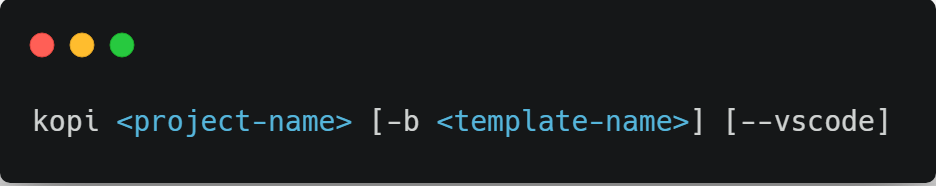

# kopi

A project generator tool for your web applications.

## How it works

`kopi` is a command-line tool which generates an application based on pre-defined templates. It gets you up and running in a few seconds, so you can focus on your awesome application right away without having to care about boring boilerplate code.

`kopi` creates a folder for your application, installs the chosen template, install NPM dependencies if any and can even open VS Code for you ! See the Usage section for the list of templates and available options.

## Installation

### Prerequisites

- NodeJS
- npm version 3+
- Git

Open a command prompt and run :

`npm install -g kopi installer`

`kopi` is now installed globally on your machine, you can use it anywhere !

## Usage

    

### Options

- `-b <template-name>` or `--boilerplate <template-name>` : specifies the template to use (see the following section for the list of available templates). Defaults to [vue-dashboard](https://github.com/mathilde-lannes/vue-dashboard). 
- `--vscode` : opens the newly created project with VS Code after installing it. Only available on Windows.
  
### Available templates

-  [vue-dashboard](https://github.com/mathilde-lannes/vue-dashboard) : Vue app with router, Vuex, aesthetic components to build a powerful dashboard and many more !

### Templates soon available

- ReactJS template
- Angular 6 template
- Scala back-end template
- Ionic 3 template
- Electron template

### Examples

- Create an application named `my-app` using the default template (vue-dashboard) :

`kopi my-app`

- Create an application named `my-app` specifying the `vue-dashboard` template and open VSCode right after the installation :

`kopi my-app -b vue-dashboard --vscode`

 

    

